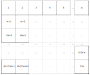

# Flow free solver
This is a pet project to learn some OpenCV and Python. The idea came when trying to quantify the intuitive leaps that occur when solving Flow Free. A glance at some empty spaces quickly indicate whether you can fit the remaining lines into it, and whether you are making choke points.  

In its simplest form, this is a path solving problem. Normally, this problem is to find the shortest path between two points, and in this game that may not always be the right path, since you need to both connect all the dots, and fill all fields on the board.  Several considerations have come to mind. The simplest (5x5 - 6x6) levels may be solvable by using Dijkstra or A*, since the space is limited, and the number of loops and circuitious routes is limited.  

However, the harder boards (>8x8) may need more advanced algorithms. 

One approach could be to do a modified A* variant which both takes into account whether the other colors are cut off, or a set of failure contitions are triggered, which will invalidate the deduced path.

My first priority is not to be as Pythonic as possible, but to get a feel for the different libraries related to computer vision.  

# Current issues and notes
* Ads make a lot of noise, and give a lot of extra thresholds 
  * Quick fix is to just buy the ad-free (which i would prefer), but that requires GAPPS on th3 device, which is not the case on current test device
  * Even though we are blacking out everything but the playing board, we are still getting contours detected there. Is this a case of similarly named variables?
* Gradient background gives shadows on some boards which are not easily removed. Current fix is to use a bigger Gaussian blur, but it is my impression that this solution is generating extra contours.  


## Overall TODO list
First figure out if we can solve the problem, then detect the layout and problem, and draw the solution...

1. [x] Set up game board
1. [ ] Solve pathing
   - [ ] Create layout for field
   - [ ] Connect Colours
   - [ ] Find orphans
   - [ ] Solve paths
   - [ ] Advanced pathfinding/optimisations
1. [x] Draw solution
1. [x] Detect playing field (only rectangles to start with)
1. [x] Detect piece placement
1. [x] Save picture of solution
1. [ ] Draw solution on device
1. [ ] Save screenshot of completed level from device
1. [ ] Get next level
   - [ ] Detect ad (currently running on device without GAPPS so can't remove ads)
   - [ ] Decline ad
   - [ ] Get next pack when pack completed (you wish) 

## Board setup

### Calculating Neighbouring cells
For somne reason, I put this into a single list instead of using a two-dimensional list. The advantage is that it is easy to iterate through, and as long as the mathemtics is clear, figuring out the dimensions and constraints is actually quite simple.  
I have decided to keep the single list for now.  
Considering height `h` and width `w`, the rectangle will be like this:



So all non-edge cells (denoted `n`) have four neighbours: 
1. North (`n-w`)
1. South (`n+w`)
1. West (`n-1`)
1. East (`n+1`)

### Cells with 2 neighbours only 
The four corners that have only two neighbours are:
1. North-West (`n=1`)
1. North-East (`n=w`)
1. South-West (`n=1`)
1. South-East (`n=((h-1)*w)+1`)

### Cells on edges 
This includes the cells with only 2 neighbours twice, except for cell 1
1. Top row (`n<=w`)
1. Bottom row (`n>=(h*w)-w`)
1. First column (`n%(w+1)=0`) (doesn't match cell 1)
1. Last column (`n%w=0`)

### Calculating total number of intersections
All the vertical paths can be summed up as the number of columns minus one, multiplied by the number of rows. Similarly, the horizontal paths can be summe up as the number of rows minus one, multiplied my the number of columns. 

`t=(w-1)*h+(h-1)*w`


## Failure Conditions
Since we are solving not only a single path, but several paths (the bigger levels hhave between 9 and 12 pairs that need to be matched), it is advantageous to figure out if there are coonditions that will enable us to discard a path as early as possible.
Conditions that would cause a failure state, ie the game would be unsolvable.  

__*TODO:*__ screenshots for each of these conditions.

* **Orphan unoccupied cell.** Cell where all neighbours are occupied, but the cell itself isn't.
* **Single cell kink.** Line creating a cell with only one free neighbour, all other (max 3) neighbouring cells occupied.
* **Orphaned Piece.** Pieces of the same colour on opposite sides of the line.
* **Invalid Circumnavigation.** Piece with a single cell on each side after passing a line. This would give orphan unoccupied cells on botth sides of a piece.
* **Corner with double line leading to it.** This would only allow a line to double back on itself, which has not (as far as I have seen) been part of a valid solution. If there are no pieces in a corner, then the number of lines will most likely be more than one.
* **Bottleneck.** A situation where the remaining cells are split into two or more areas, where the spaces available to pass from one side to the other is smaller than the number of lines we need to pass through the barrier.

## Path solving tactics

### Path solving
* **Outside to inside.** Finding a piece in the outer cells, and following the border clockwise (CW) or counter-clockwise (CCW)., repeating the method on each colour pair, until solved.  
This tactic wil most likely work for simple, small boards. In case of having to snake around another this tactic will fail. May be able to be used as a trailbreaker.
  * CCW pseudo-algorithm
  ```
  if No neighbour on side X
    if we can go Left compared to X (if x = SOUTH, direction (D) = East, D+1 = North)
      if D unoccupied
        go D
      elseif D occupied
        if D+1 unoccupied
          go D+1, D
        else
          fail
  
  ```
* **Single cell path.** If both pieces share a single cell neighbour, so that filling out that cell will connect them. E.g. diagonals may be a more certain win, verticals or horizontals may not be.
* **Path finding algorithms** These will find the shortest path, but may not be efficient for finding the first paths in an unsolved board.
  * **A-Star.** Using the [A*](https://en.wikipedia.org/wiki/A*_search_algorithm) algorithm for path finding. [Sample Python Implementation](https://www.simplifiedpython.net/a-star-algorithm-python-tutorial/)
  * **Dijkstra.** Using [Dijkstra's algorithm](https://en.wikipedia.org/wiki/Dijkstra%27s_algorithm) for path finding. [Sample Python implementation](https://www.udacity.com/blog/2021/10/implementing-dijkstras-algorithm-in-python.html)

### Path certainty score
* Any path creating a failure condition with no other paths drawn should be considered unusable - negative score.
* A single cell path where there is a dead end e.g. in the corner of a board should be a high scorer.